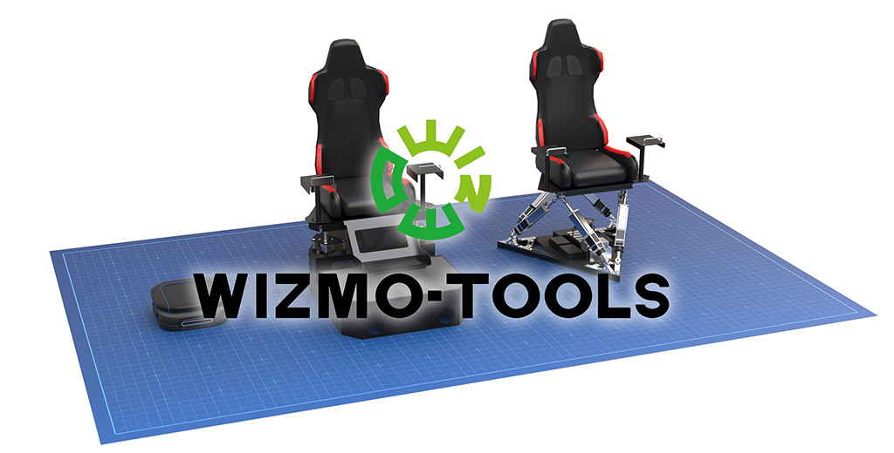
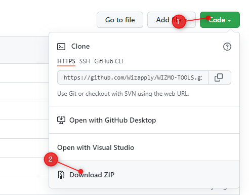

WIZMOTOOLS (SIMVR SDK, ANTSEAT SDK)
==================

WIZMOTOOLSは、WIZAPPLYのサポートが認定された多軸モーションシミュレータ機（SIMVR、ANTSEAT等）を簡単に稼働させるためのシステムツール群です。ピッチ・ヨー・ロール、ヒーヴ・スウェイ・サージの動きがこの開発ツールで動作させることが可能です。ここでは、アプリケーションを開発するための信頼性の高いツール・プログラムがあります。  
今後、様々な外部アタッチメントを用いたカスタムのVRシミュレータなども対応予定です。

ライセンスされたモーションシミュレータ用で、デバイス1台につき1ライセンス必要です。ライセンス希望の方は[お問い合わせ先](#お問い合わせ先)までご連絡くださいますようお願い致します。
また、プログラムに不具合がございまいたらご報告いただければ幸いです。

〇 WIZMO公式ホームページ： <https://motion.wizapply.com/>

## WIZMO対応シミュレータ
* SIMVR製品ページ ： <https://motion.wizapply.com/simvr/>
* SIMVR 6DOF製品ページ： <https://motion.wizapply.com/simvr6dof/>
* ANTSEAT製品ページ： <https://motion.wizapply.com/antseat/>

## フォルダ構成
* `/build_c++` : C++(VisualStudio, CMAKE)で開発可能なファイル
* `/build_csharp` : c#で開発可能なcsファイル・プロジェクトファイル
* `/build_python` : Pythonで開発可能なpyファイル
* `/build_rust` : Rustで開発可能なrsファイル・プロジェクトファイル
* `/build_unity` : Unity2021以降で開発可能なUnityPackageファイル
* `/build_ue5` : UnrealEngine5で開発可能なプラグイン及びプロジェクト
* `/cad_datas` : ハードウェア・筐体CAD情報
* `/manuals` : ハードウェアの取扱説明書
* `/demo` : 動作を確認するためのサンプルデモ
* `/tools` : ユーティリティ等のソフトウェア
* `/resources` : GitHub用リソースファイル（開発には必要ありません）

## 必須動作環境
* オペレーティングシステム : Windows 10以降、Linux 4.4.0以降
* インターフェース : USB2.0ポート1つ以上、LAN環境
* ドライバ等のインストールは不要

※ 製品を動作させるためだけの環境であり、開発するVRなどのコンテンツ規模に合う**高性能パソコン**をご用意ください。

### ツールのダウンロード方法
リリースよりダウンロード  
[**リリース最新版をダウンロード**](https://github.com/Wizapply/WIZMO-TOOLS/releases)

もしくはGitHub右上ボタンよりクローンかダウンロード  
  

### 実行・セットアップ
WIZMOTOOLSの使い方・セットアップについては、[**SIMVR-Tools Wiki**](https://github.com/Wizapply/SIMVR-Tools/wiki "SIMVR-Tools Wiki")にまとめておりますので、そちらをご覧ください。  
※改修予定

## 開発向けライセンスについて
これらのファイルによって開発されたアプリケーションを実機で稼働させるためにライセンス認証が必要です。  
筐体にライセンスされて、ご利用が認められておりますので、別の筐体によるビジネスや展示会等でご利用の際は追加でライセンスしてください。  
SIMVR本体にライセンスが付与されますので、所有者・利用者に制限はありません。  

開発しているアプリケーションを認証するには[**WIZMOキーのオンライン発行**](https://simvr.wizapply.com/simvrkeygen/)でキーを取得してください。  
※ANTSEATやLAN接続時はアプリケーションの認証は必要ありません。  

## エミュレータについて
   
エミュレータは実機が無くても動作確認ができるシステムです。  
「tools」フォルダ内の「[**simvr_emulator**](https://github.com/Wizapply/WIZMOTOOLS/tree/main/tools/simvr_emulator)」をご確認ください。

## シーケンサについて
   
シーケンサは動画やタイミングコマンドと連動した動きを付けるためのツール群です。  
ゲームエンジンやプログラミングの難しい知識なしにシミュレータを使用できます。  
「tools」内の「[**simvr_sequencer**](https://github.com/Wizapply/WIZMOTOOLS/tree/main/tools/simvr_sequencer)」をご確認ください。

## お問い合わせ先
これらGitHubにアップロードされている全てのファイルについてのご質問・ご報告は、下記連絡先までお問い合わせください。  
体感に関するご相談（コンサルティング）・ソフトウェア開発も行っておりますので、下記内容からご連絡くださいませ。  

  
WIZAPPLY株式会社  
大阪府大阪市港区市岡元町3-7-10 KSビル5F  
E-Mail : info@wizapply.com  
TEL : 06-4400-6308  
Web : <https://wizapply.com>  
